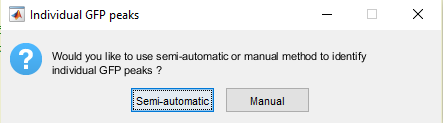

# GFPPeaks

The MATLAB script in this repository enable the semi-automatic identification of [Global Field Power (GFP)](https://www.hindawi.com/journals/cin/2011/813870/) peaks on Event-Related Potentials (ERP) files 

**⚠️ OF NOTE: The analysis script can currently only import .ep EEG files (see [Cartool](https://sites.google.com/site/cartoolcommunity/)).**


## Cite the repository
C.A. Wicht, GFPPeaks, (2020), GitHub repository, https://github.com/CorentinWicht/GFPPeaks \
*Missing DOI*

## Table of Contents
XXX

## Getting Started

When on the [GFPPeaks startup page](https://github.com/CorentinWicht/GFPPeaks), start by clicking on `⬇️ Code` on the top right of the screen and then `Download ZIP` to download the whole repository (alternatively you can also clone it). 
Then, you will need to run the following script: ```GFPPeaks.m```


You will find below a step by step explanation on how to run each script in MATLAB (by clicking on the `▶️ Run` button or on your keyboard's button `⌨️ F5`).


### 1.Loading Files


Here you are asked to provide the most upper folder containing all your ERP files with .ep extension.


### 2.Processing Mode



You can choose between a semi-automated or manual processing modes. \
The semi-automated method looks for the GFP peak inside each component's upper and lower bounds as defined in chapter **XXX**, see chapter **XXX** for an exemple of the window. \
The manual method requires you to enter manually the GFP peaks for each files (identified for e.g. with CARTOOL) in the table detailed in chapter **XXX**. 


### 3.Design Definition


The third prompt enables the definition of the statistical design.

These are the designs that are currently accepted:
```
* 1 between-subjects factor
* 1 within-subjects factor
* 1 between- & 1 within-subjects factors
* 2 between-subjects factors
```
There can only be **up to 2 levels for each factor !**

There is already an example that shows you how to fill the first two columns, namely on the... :
```
* First line you should indicate whether Factor1 is a Between-subjects (B) or Within-subjects (W) factor
* Second line you should give a name to the Factor
* Third and fourth lines you need to define the name of each levels.\
```
**The last point is case-sensitive since the name you pick as levels should match either a pattern in your EEG files or the name of subfolders in which you separated the files.**

Additionally, you have the possibility to ignore specific `folder(s)` and/or `file(s)` that are inside the EEG files-containing upper folder.\
For example, if you would like to ignore every EEG files that contains the pattern `_EXCLUDE`, just write this pattern in the first box under the `IgnoreFiles` header.

**Once you are done, press on the cross `X` on the top-right corner and the code will resume**


### 4. Data Files Selection


Here you have the possibility to decide whether you want to process all data contained in the folder you provided in [Chapter 1](###1.loading-files). \
THIS LINK IS NOT WORKING !!


