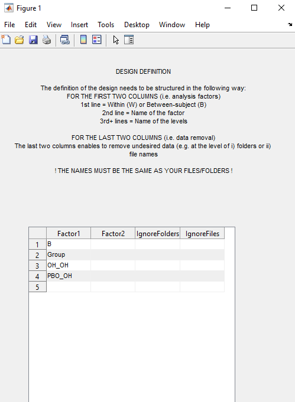

# GFPPeaks

The MATLAB script in this repository enable the semi-automatic identification of [Global Field Power (GFP)](https://www.hindawi.com/journals/cin/2011/813870/) peaks on Event-Related Potentials (ERP) files. 

The method is based on: [Wicht, C.A., De Pretto, M. & Spierer L.; Neural correlates of expectations-induced effects of caffeine intake on executive functions; Cortex Registered Reports, *stage 1 in principle acceptance*](https://osf.io/sudnm/)


**⚠️ OF NOTE: The analysis script can currently only import .ep EEG files (see [Cartool](https://sites.google.com/site/cartoolcommunity/)).**


## Cite the repository
C.A. Wicht, GFPPeaks, (2020), GitHub repository, https://github.com/CorentinWicht/GFPPeaks \
*Missing DOI*

## Table of Contents
XXX

## Getting Started

When on the [GFPPeaks startup page](https://github.com/CorentinWicht/GFPPeaks), start by clicking on `⬇️ Code` on the top right of the screen and then `Download ZIP` to download the whole repository (alternatively you can also clone it). 
Then, you will need to run the following script: ```GFPPeaks.m```


You will find below a step by step explanation on how to run each script in MATLAB (by clicking on the `▶️ Run` button or on your keyboard's button `⌨️ F5`).


### 1. Loading Files


Here you are asked to provide the most upper folder containing all your ERP files with .ep extension.


### 2. Processing Mode


You can choose between a semi-automated or manual processing modes. \
The semi-automated method looks for the GFP peak inside each component's upper and lower bounds as defined in [Chapter 7](#7-erp-components-definition), *see* [Chapter 8.1](#81-main-window) *for an example of the main GFP Peaks window.* \
The manual method requires you to enter manually the GFP peaks for each files (identified for e.g. with CARTOOL) in the table detailed in [Chapter 8.2](#82-data-table). 


### 3. Design Definition



The third prompt enables the definition of the statistical design.

These are the designs that are currently accepted:
```
* 1 between-subjects factor
* 1 within-subjects factor
* 1 between- & 1 within-subjects factors
* 2 between-subjects factors
```
There can only be **up to 2 levels for each factor !**

There is already an example that shows you how to fill the first two columns, namely on the... :
```
* First line you should indicate whether Factor1 is a Between-subjects (B) or Within-subjects (W) factor
* Second line you should give a name to the Factor
* Third and fourth lines you need to define the name of each levels.\
```
**The last point is case-sensitive since the name you pick as levels should match either a pattern in your EEG files or the name of subfolders in which you separated the files.**

Additionally, you have the possibility to ignore specific `folder(s)` and/or `file(s)` that are inside the EEG files-containing upper folder.\
For example, if you would like to ignore every EEG files that contains the pattern `_EXCLUDE`, just write this pattern in the first box under the `IgnoreFiles` header.

**Once you are done, press on the cross `X` on the top-right corner and the code will resume**


### 4. Data Files Selection


Here you have the possibility whether you would like to process all the data in the folder path you provided in [Chapter 1](#1-loading-files) or only a subset of the files. \


### 5. Include Files


Here you have the possibility to decide which data you like to process. \
Close the window once you are satisfied with your choice.


In MATLAB's command window you will see the list of correctly loaded files according to your selection in the previous prompt.


### 6. ERP Parameters


In this prompt you need to:
```
1) define the epoching interval of your files (e.g. -100 to 700ms), in MILLISECONDS (!). 
2) report the sampling rate (e.g. 1024Hz).
3) Define a folder name where to save the results (e.g. "Output").
```

### 7. ERP Components Definition


This is one of the most important prompt ! \
On each of the four lines you have the possibility to define a specific ERP component of interest. \
Each column should be filled accordingly:
```
Column 1: Type in the name of the component (e.g. N2)
Column 2: Define the lower bound in ms for the component of interest (e.g. 200ms)
Column 3: define the upper bound in ms for the component of interest (e.g. 350ms)
Column 4 & 5: Indicate which electrode(s) are the most representative of the component of interest (e.g. "CPz" for component N2).
```

**Note that on columns 4 & 5 you HAVE to indicate at least 1 electrode and up to 2 electrodes** \
This information will be used in the GFP peaks main display in [Chapter 8.1](#81-main-window)


### 8. GFPPeaks Windows
#### 8.1 Main Window


This is the main window which will enable you to determine whether the preselected GFP peak in the data table (*see* [Chapter 8.2](#82-data-table)) is correct. \
The window displays *from left to right, top to bottom*:
```
1) The ERP including all channels (each channel is represented as one line) [top left].
2-3) The ERP data for the most representative electrode(s) input in the table, Chapter 7 [top right and bottom left].
4) The GFP data for epoch of interest [bottom right].
```
The vertical bar represent, for all graphs, the position of the maximum GFP identified by the script (the maximum is really visible in the bottom right graph). \
Next to the vertical bar, you have the exact peak position in ms and in time-frames (TF; i.e. dependent of your sampling rate).

**WHAT DO THE BAR MEANS IN THE END?!?!??!**

On the far right you will find the topography at the GFP peak (indicated in TF in the title). \
You have the possibility to use the slide bar below to inspect the topography of the whole ERP period.


#### 8.2 Data Table


This table will popup next the main figure from [Chapter 8.1](#81-main-window). \
**⚠️ DO NOT CLOSE THIS TABLE BEFORE YOU ARE FINISHED WITH THE CURRENT FILE ⚠️**.

The GFP peak for the current file will be prefilled if you selected the semi-automatic method while the table will be completely empty if you selected the manual method (*see* [Chapter 2](#2-processing-mode)).

For the semi-automatic method, either you leave the prefilled value if you think it is correct or you can change it manually. \

**Once you are satisfied with your results you can close the data table and the results will be saved**.

### 9. Exported Figure


You are now done with the script and based on what you gave in [Chapter 6](#6-erp-parameters) as folder name for the outputs, you fill find the figure above.\
This figure shows the mean GFP data for the provided ERP epoch, separated by conditions/groups (i.e. depending on your design). \
The vertical red line represents the mean GFP peak while the red rectangle represents +- 1 Standard Deviation (SD) around the mean peak.\
Finally, below the GFP graph you will find the topography averaged over the period included in +- 1 Standard Deviation (SD) around the mean peak (i.e. time range of averaging indicated in TF in the title).

